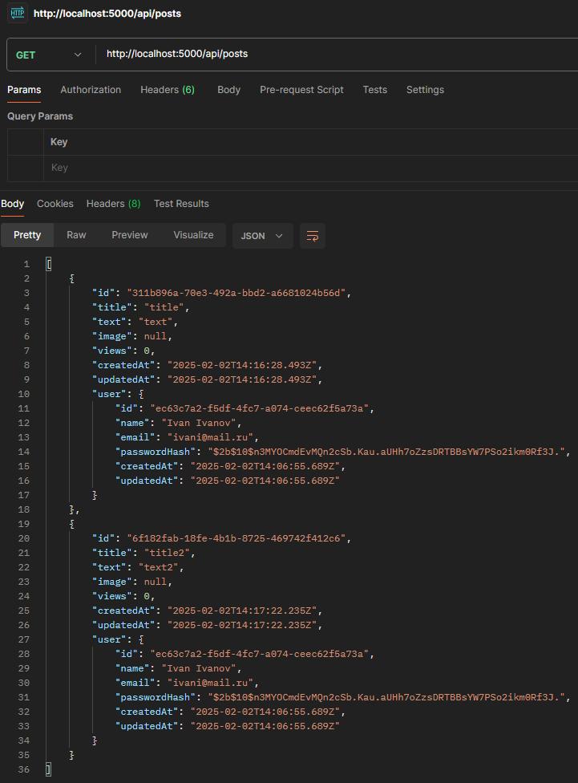
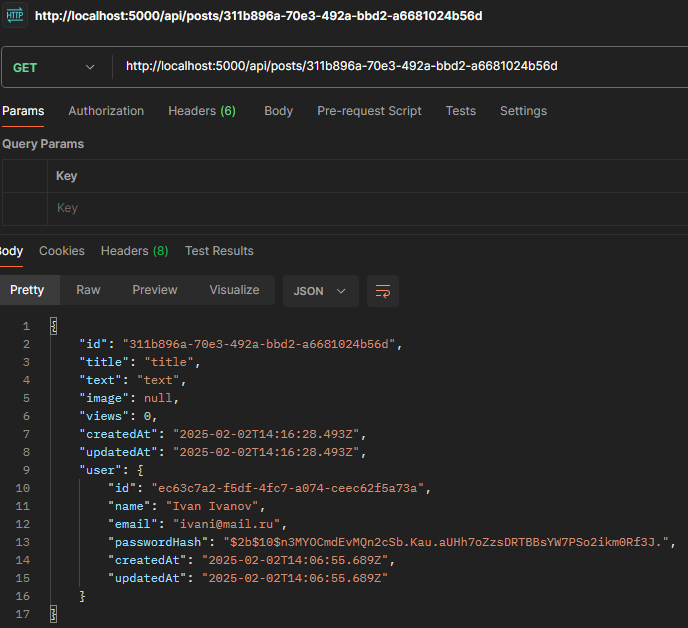

# Приложение для ведения блога  

Веб-приложение, позволяющее авторам создавать и управлять блогами, а читателям — просматривать и взаимодействовать с контентом. Поддерживает систему статистики и удобные инструменты для поиска и фильтрации записей.  

## Основные требования  

### 1. Регистрация и аутентификация  
- Регистрация пользователей.  
- Вход и выход из системы.    

### 2. Управление постами  
- Создание, редактирование, удаление и просмотр постов.    
- Добавление изображений.   

### 3. Статистика и аналитика  
- Подсчет просмотров статей.  

### 4. Поиск и фильтрация  
- Поиск по заголовку и содержимому статей.  
- Сортировка по популярности и дате.  

### 5. Взаимодействие между пользователями
- Подписка на других пользователей.
- Лента постов от подписанных пользователей.
- Лайки и дизлайки постов.
- Комментирование постов.
- Уведомления о новых подписках, лайках и комментариях.
### 6. Модерация контента
- Жалобы на контент (неприемлемые посты, спам).
- Блокировка пользователей за нарушение правил.
- Роль модератора с возможностью удаления контента.
### 7. Монетизация
- Донаты для авторов.
- Подписки на эксклюзивный контент.
- Реклама в постах.
### 8. Настройки профиля
- Изменение аватара, имени, описания профиля.
- Настройки приватности (например, закрытый профиль).
- Смена пароля, привязка почты и телефона.
### 9. Интеграция с другими сервисами
- Авторизация через Google, Facebook и другие сервисы.
- Поделиться постом в других соцсетях.

# Применение DDD к веб-приложению для ведения блога  

В основе DDD лежит четкое разделение предметной области.  

## Ограниченные контексты  

1. **Контекст аутентификации**  
   - Отвечает за регистрацию, вход и выход пользователей.  
   - Управляет учетными записями.  

2. **Контекст управления постами**  
   - Обрабатывает создание, редактирование и удаление постов.  
   - Связывает авторов с их постами.  

3. **Контекст статистики**  
   - Отвечает за подсчет просмотров.  

4. **Контекст поиска и фильтрации**  
   - Позволяет искать статьи по заголовку и содержимому.  
   - Обеспечивает сортировку по популярности и дате.  

## Сущности и объекты-значения

### Authentication Context  
- `User` (Сущность)  
  - `id`: string (UUID)
  - `name`: string
  - `email`: string (unique)
  - `passwordHash`: string
  - `createdAt`: Date
  - `updatedAt`: Date  

### ArticlePost Management Context  
- `Post` (Сущность)  
  - `id`: string (UUID)
  - `title`: string
  - `text`: string
  - `image`: string (nullable)
  - `views`: number (default: 0)
  - `createdAt`: Date
  - `updatedAt`: Date
  - `user_id`: string (foreign key, связывает с пользователем)

### Search & Filtering Context  
- `SearchQuery` (Value Object)  
  - `query: string`  
  - `filters: Filters`  

- `Filters` (Value Object)  
  - `sortBy: enum (DATE, POPULARITY)`  

## Агрегаты 
- `Authentication Aggregate`: регистрация и вход пользователя.
- `Post Aggregate`: создание, редактирование, удаление постов, добавление медиа.
- `Search & Filtering Aggregate`: поиск и сортировка постов по дате или популярности. 

## Сервисы предметной области
- `AuthenticationService` (управляет входом, регистрацией).  
- `PostService` (CRUD для постов).  
- `SearchService` (поиск и фильтрация).  

## Репозитории
- `UserRepository` (хранение пользователей).   
- `PostRepository` (хранение статей).  

# Инструментарий  

## IDE
- **VS Code**
  
## Серверная часть  
- **Node.js**  
- **PostgreSQL**  
- **TypeORM**  
- **Multer**  
- **Bcrypt + JSON Web Token**  

### Причины выбора PostgreSQL:
- Быстродействие: поддерживает индексы, оптимизирован для поиска по заголовкам, тексту и популярности.
- Гибкость – можно хранить метаданные и реакции в JSONB, легко добавлять новые поля.
- Надежность – транзакции ACID гарантируют, что данные не потеряются.
- Поиск – встроенный полнотекстовый поиск избавляет от необходимости использовать отдельные поисковые движки.
- Масштабируемость – поддерживает репликацию и шардирование для работы с большим числом пользователей.

## Клиентская часть  
- **React**  
- **Redux Toolkit**  
- **Styled Components**
23:13

- **Axios**  

# Модель данных для проекта

#### 1. На уровне приложения:
- **TypeORM** для работы с объектами и реляционной базой данных.
- Сервисы для CRUD операций: **AuthenticationService**, **BlogService**, **ArticleService**.
- **Redux Toolkit** для управления состоянием на клиенте.

#### 2. На уровне хранения данных:
- **PostgreSQL** для хранения данных:
  - **users**: 
    - `id`: string (UUID)
    - `name`: string
    - `email`: string (unique)
    - `passwordHash`: string
    - `createdAt`: Date
    - `updatedAt`: Date

  - **posts**: 
    - `id`: string (UUID)
    - `title`: string
    - `text`: string
    - `image`: string (nullable)
    - `views`: number (default: 0)
    - `createdAt`: Date
    - `updatedAt`: Date
    - `user_id`: string (foreign key, связывает с пользователем)

# Реализация проекта 
Стартовая реализация проекта представлена в папке server. В ней содержится серверная часть приложения.
Авторизация и работа постов проверена при помощи юнит-тестов:

Также тестирование выполнялось при помощи Postman:

# Запуск проекта
Открыть в терминале /server, выполнить команду npm i, затем команду npm run dev. Так же нужен .env файл в папке server с содержимым:
DB_HOST = localhost
DB_PORT = 5432
DB_USER = postgres
DB_PASSWORD = root
DB_NAME = postgres
SECRET_KEY = secret_key