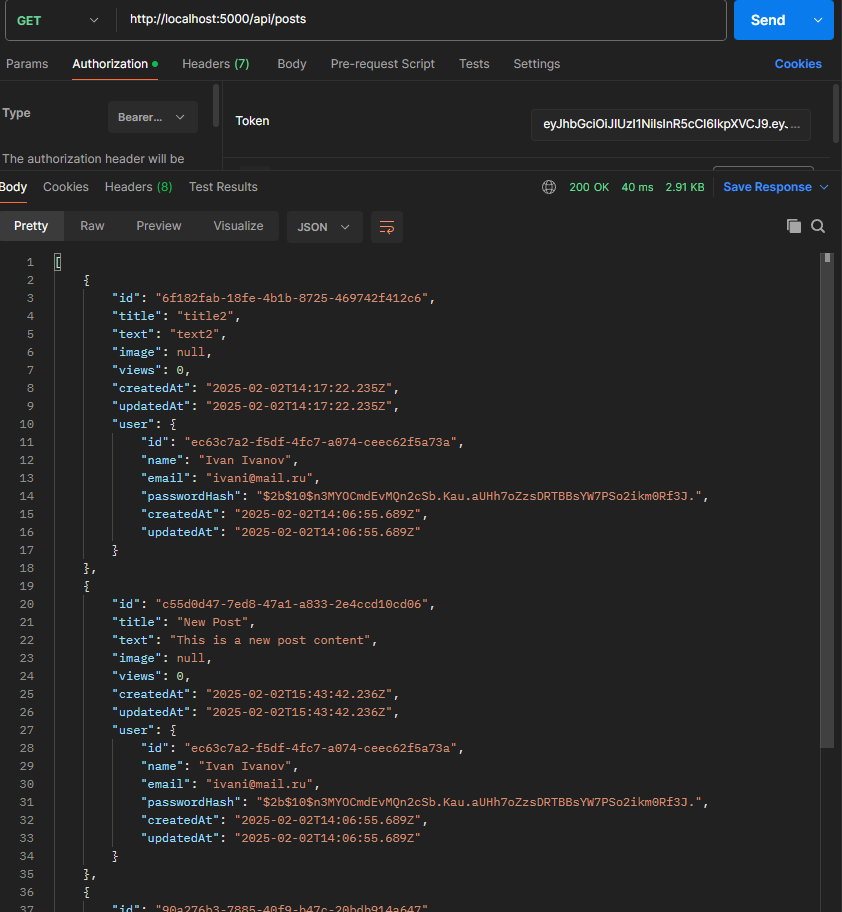

## Выполненные задачи:
- Подключен `async-runtime` к DSS.  
- Реализовано подключение PostgreSQL.  
- Выделены слои DSS и отражены в коде.
- Сделаны тесты.  
- Созданы первичные `Dockerfile` и `docker-compose` для DSS и её инфраструктуры.  

## Демонстрация работы:
### Регистрация пользователя:

### Авторизация пользователя:

### Получение постов:

### Получение конкретного поста:

### Удаление конкретного поста:

### Создание поста:

### Обновление поста:

### Рабочий Docker:
