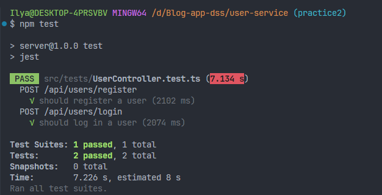
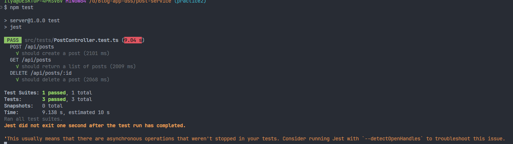
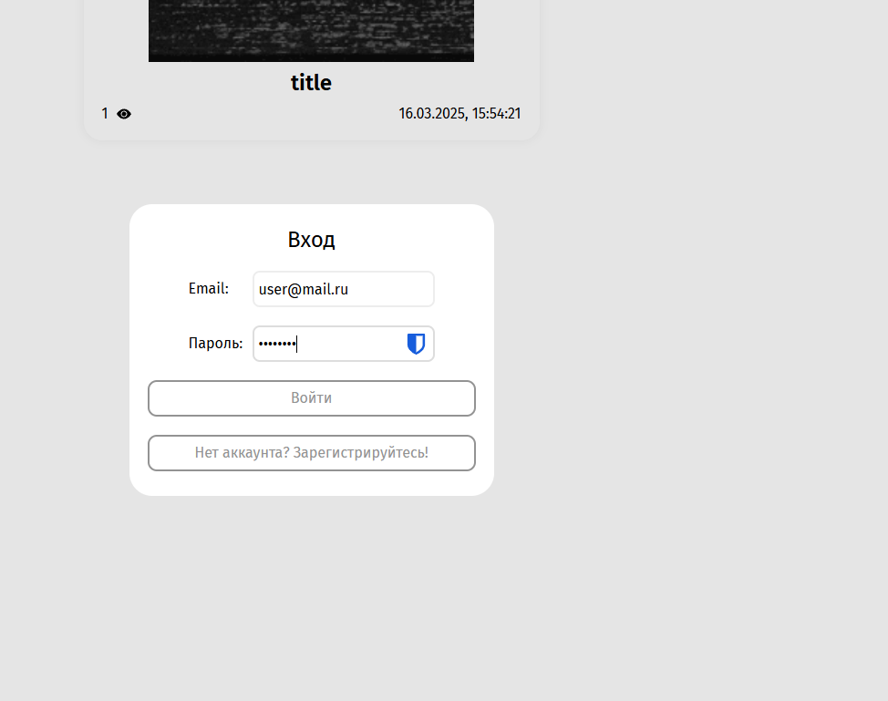
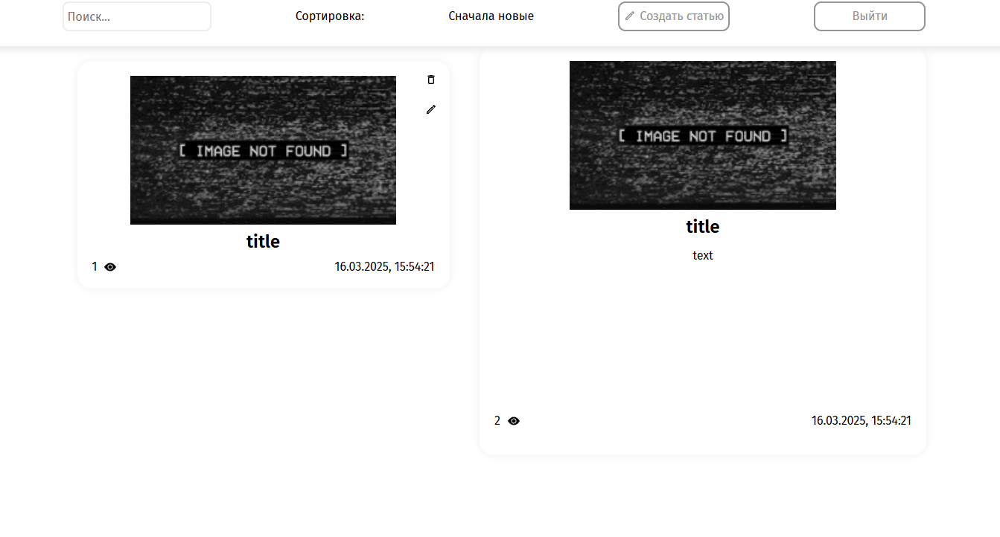
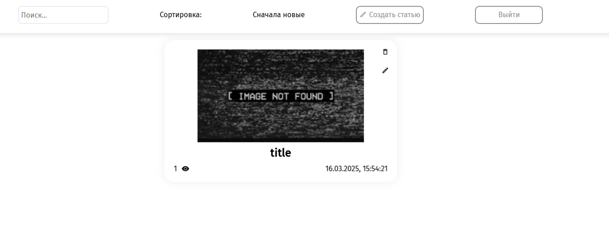
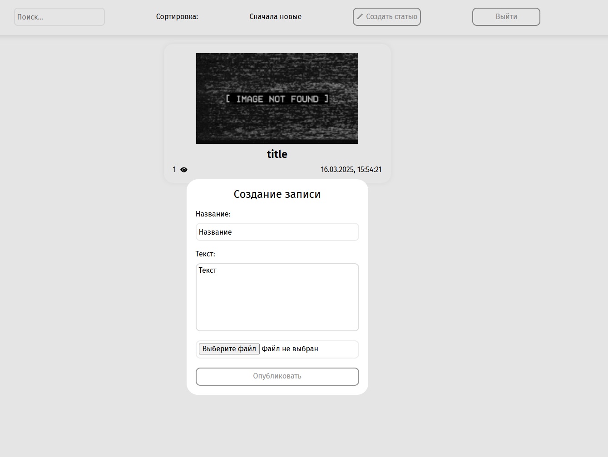
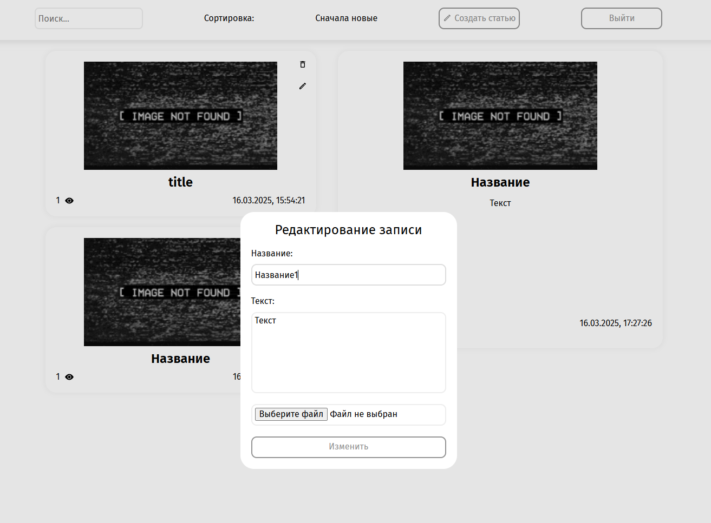
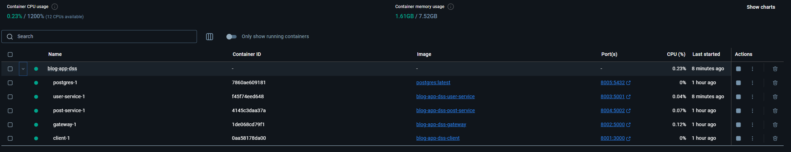
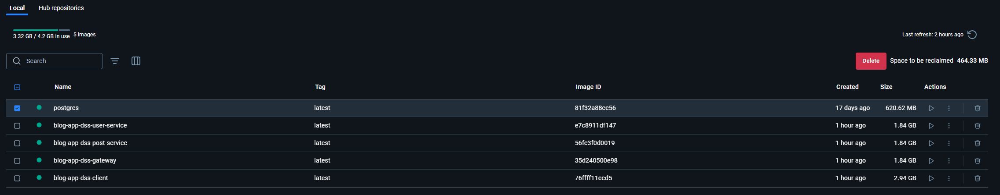
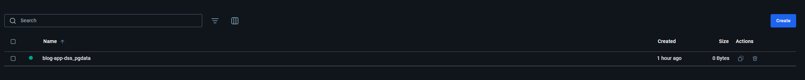

## Выполненные задачи:

В ходе данной работы было проведено разделение монолитного приложения для ведения блога на микросервисную архитектуру.

Для нашей DSS был выбран синхронный API. В нашей системе не используются брокеры сообщений по типу Kafka/RabbitMQ. Использование синхронного подхода для взаимодействия между сервисами упрощает реализацию и контроль над процессами. Синхронные вызовы дают немедленный ответ, упрощая обработку ошибок и управление потоком данных.

В результате работы приложение было разделено на четыре микросервиса:

- клиент (client) – фронтенд-приложение, с которого пользователи взаимодействуют с системой;
- gateway – промежуточный сервис, принимающий запросы от клиента и направляющий их к соответствующим микросервисам;
- микросервис пользователей (user-service) – отвечает за работу с пользователем (регистрация, авторизация);
- микросервис постов (post-service) – управляет созданием, просмотром, редактированием и удалением постов.

Взаимодействие между микросервисами осуществляется следующим образом:

- клиент отправляет запросы на gateway;
- gateway анализирует запрос и перенаправляет его в соответствующий микросервис;
- user-service обрабатывает запросы, связанные с пользователями (регистрация, авторизация, получение информации о пользователе для проверки авторизации);
- post-service обрабатывает запросы, связанные с постами (создание, просмотр, редактирование, удаление).

Разделение на микросервисы позволило:

- облегчить поддержку и развитие системы;
- улучшить масштабируемость;
- повысить отказоустойчивость, благодаря изолированности сервисов;
- упростить внедрение CI/CD.

## Демонстрация работы:

### Рабочие тесты:

### Получение постов:

### Авторизация пользователя:

### Получение конкретного поста:

### Удаление конкретного поста:

### Создание поста:

### Обновление поста:

### Рабочий Docker:

